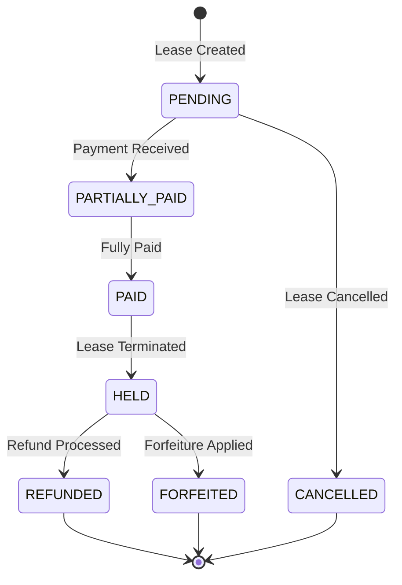

# Security Deposit Management System

## Overview

The Security Deposit Management System provides comprehensive handling of security deposits for vehicle leases in the BAT Connect platform. This system manages the complete lifecycle of deposits from creation during lease setup through collection, hold periods, and eventual refund or forfeiture.

## Key Features

- **Complete Lifecycle Management**: Creation → Collection → Hold → Refund/Release
- **Multi-Method Collection**: Support for CASH, CHECK, ACH, and other payment methods
- **Automated Workflows**: Payment reminders, hold expiry processing, ledger reconciliation
- **BPM Integration**: Seamless integration with lease creation and termination flows
- **Ledger Integration**: Automatic posting to centralized ledger with DEPOSIT category
- **Interim Payment Support**: Allocation of interim payments to outstanding deposits
- **Audit Trail**: Complete history of all deposit transactions and status changes

## Architecture

### System Components

```
┌─────────────────┐    ┌─────────────────┐    ┌─────────────────┐
│   BPM Flows     │    │  API Router     │    │  Background     │
│                 │    │                 │    │  Tasks          │
│ • Lease Creation│    │ • CRUD Ops      │    │ • Reminders     │
│ • Termination   │    │ • Collections   │    │ • Hold Expiry   │
│ • Interim Pay   │    │ • Refunds       │    │ • Reconciliation │
└─────────────────┘    └─────────────────┘    └─────────────────┘
         │                       │                       │
         └───────────────────────┼───────────────────────┘
                                 │
                    ┌─────────────────┐
                    │   Services      │
                    │                 │
                    │ • Business Logic│
                    │ • Validation    │
                    │ • Calculations  │
                    └─────────────────┘
                             │
                    ┌─────────────────┐
                    │  Repository     │
                    │                 │
                    │ • Data Access   │
                    │ • Queries       │
                    └─────────────────┘
                             │
                    ┌─────────────────┐
                    │   Database      │
                    │                 │
                    │ • deposits tbl  │
                    │ • ledger integ  │
                    └─────────────────┘
```

### Data Flow

1. **Lease Creation**: BPM Step 133 creates deposit record
2. **Payment Collection**: Via API or interim payments
3. **Lease Termination**: Automatic hold period initiation
4. **Hold Expiry**: Background task processes refunds/releases
5. **Manual Operations**: API endpoints for adjustments

## Deposit Lifecycle



### Status Definitions

| Status | Description | Actions Allowed |
|--------|-------------|-----------------|
| `PENDING` | Deposit created, no payment received | Collection, Cancellation |
| `PARTIALLY_PAID` | Some payment received, outstanding balance | Collection, Cancellation |
| `PAID` | Full amount collected | Hold initiation, Refunds |
| `HELD` | Lease terminated, hold period active | Refund, Forfeiture |
| `REFUNDED` | Hold expired, amount returned to driver | None |
| `FORFEITED` | Amount retained by company | None |
| `CANCELLED` | Deposit cancelled before collection | None |

## API Documentation

### Base URL
```
/api/v1/deposits
```

### Authentication
All endpoints require authentication via JWT token in Authorization header.

### Endpoints

#### List Deposits
```http
GET /api/v1/deposits/
```

**Query Parameters:**
- `lease_id` (int): Filter by lease ID
- `status` (str): Filter by deposit status
- `page` (int): Page number (default: 1)
- `per_page` (int): Items per page (default: 25)

**Response:**
```json
{
  "items": [
    {
      "deposit_id": "DEP-123-01",
      "lease_id": 123,
      "required_amount": 1000.00,
      "collected_amount": 500.00,
      "outstanding_amount": 500.00,
      "deposit_status": "PARTIALLY_PAID",
      "collection_method": "CASH",
      "created_at": "2025-01-01T00:00:00Z"
    }
  ],
  "total": 1,
  "page": 1,
  "per_page": 25
}
```

**cURL Example:**
```bash
curl -X GET "http://localhost:8000/api/v1/deposits/?lease_id=123" \
  -H "Authorization: Bearer YOUR_JWT_TOKEN"
```

#### Get Deposit Details
```http
GET /api/v1/deposits/{deposit_id}
```

**Response:**
```json
{
  "deposit_id": "DEP-123-01",
  "lease_id": 123,
  "driver_tlc_license": "T123456C",
  "required_amount": 1000.00,
  "collected_amount": 500.00,
  "outstanding_amount": 500.00,
  "deposit_status": "PARTIALLY_PAID",
  "collection_method": "CASH",
  "initial_collection_amount": 300.00,
  "hold_expiry_date": null,
  "lease_termination_date": null,
  "notes": "Initial payment received",
  "created_at": "2025-01-01T00:00:00Z",
  "updated_at": "2025-01-01T12:00:00Z"
}
```

#### Collect Deposit Payment
```http
POST /api/v1/deposits/{deposit_id}/collect
```

**Request Body:**
```json
{
  "additional_amount": 500.00,
  "collection_method": "CASH",
  "notes": "Final payment received"
}
```

**Response:**
```json
{
  "deposit_id": "DEP-123-01",
  "collected_amount": 1000.00,
  "outstanding_amount": 0.00,
  "deposit_status": "PAID",
  "message": "Payment collected successfully"
}
```

**cURL Example:**
```bash
curl -X POST "http://localhost:8000/api/v1/deposits/DEP-123-01/collect" \
  -H "Authorization: Bearer YOUR_JWT_TOKEN" \
  -H "Content-Type: application/json" \
  -d '{
    "additional_amount": 500.00,
    "collection_method": "CASH",
    "notes": "Final payment received"
  }'
```

#### Process Deposit Refund
```http
POST /api/v1/deposits/{deposit_id}/refund
```

**Request Body:**
```json
{
  "refund_amount": 800.00,
  "refund_method": "CHECK",
  "notes": "Partial refund after hold period"
}
```

**Response:**
```json
{
  "deposit_id": "DEP-123-01",
  "refund_amount": 800.00,
  "remaining_amount": 200.00,
  "deposit_status": "REFUNDED",
  "message": "Refund processed successfully"
}
```

#### Get Deposit Ledger History
```http
GET /api/v1/deposits/{deposit_id}/ledger
```

**Response:**
```json
{
  "deposit_id": "DEP-123-01",
  "ledger_entries": [
    {
      "posting_id": "POST-001",
      "amount": 500.00,
      "entry_type": "CREDIT",
      "reference_id": "DEP-123-01",
      "description": "Deposit payment via interim payment INTPAY-2025-00001",
      "created_at": "2025-01-01T10:00:00Z"
    }
  ]
}
```

## Integration Points

### BPM Flow Integration

#### Lease Creation Flow (Step 133)
- **Trigger**: New lease created
- **Action**: Automatically create deposit record
- **Data Source**: `lease.deposit_amount_required`
- **Integration**: `driverlease/flows.py` - `set_financial_information_with_deposit()`

#### Lease Termination Flow (Step 155)
- **Trigger**: Lease terminated
- **Action**: Initiate 30-day hold period
- **Integration**: `terminatelease/flows.py` - `process_lease_termination()`

#### Interim Payment Allocation
- **Trigger**: Payment allocated with category="DEPOSIT"
- **Action**: Apply payment to deposit, update ledger
- **Integration**: `interim_payments/services.py` - `create_interim_payment()`

### Background Tasks

#### Deposit Payment Reminders
- **Schedule**: Daily at 9:00 AM
- **Target**: Deposits with outstanding amounts > 30 days old
- **Action**: Send email notifications to drivers

#### Hold Period Expiry Processing
- **Schedule**: Daily at 2:00 AM
- **Target**: Deposits in HELD status past expiry date
- **Action**: Process automatic refunds or alerts

#### Ledger Reconciliation
- **Schedule**: Weekly on Sunday at 3:00 AM
- **Action**: Reconcile deposit balances with ledger postings

### Current Balances Integration

The View Current Balances service now pulls deposit amounts from the `deposits` table instead of the legacy `leases.deposit_amount_paid` field.

**Integration**: `current_balances/services_optimized.py` - `_get_deposit_amount_for_lease()`

## Configuration

### Environment Variables

```bash
# Deposit-specific settings
DEPOSIT_HOLD_PERIOD_DAYS=30
DEPOSIT_REMINDER_GRACE_PERIOD_DAYS=30
DEPOSIT_AUTO_REFUND_ENABLED=true

# Email settings for reminders
DEPOSIT_REMINDER_EMAIL_FROM=deposits@batconnect.com
DEPOSIT_REMINDER_EMAIL_SUBJECT="Deposit Payment Reminder"
```

### Database Tables

#### deposits
```sql
CREATE TABLE deposits (
    id INT AUTO_INCREMENT PRIMARY KEY,
    deposit_id VARCHAR(20) UNIQUE NOT NULL,
    lease_id INT NOT NULL,
    driver_tlc_license VARCHAR(20),
    required_amount DECIMAL(10,2) NOT NULL DEFAULT 0.00,
    collected_amount DECIMAL(10,2) NOT NULL DEFAULT 0.00,
    outstanding_amount DECIMAL(10,2) NOT NULL DEFAULT 0.00,
    deposit_status ENUM('PENDING', 'PARTIALLY_PAID', 'PAID', 'HELD', 'REFUNDED', 'FORFEITED', 'CANCELLED') NOT NULL,
    collection_method ENUM('CASH', 'CHECK', 'ACH', 'CREDIT_CARD', 'OTHER') DEFAULT 'CASH',
    initial_collection_amount DECIMAL(10,2),
    hold_expiry_date DATE,
    lease_termination_date DATE,
    notes TEXT,
    created_at TIMESTAMP DEFAULT CURRENT_TIMESTAMP,
    updated_at TIMESTAMP DEFAULT CURRENT_TIMESTAMP ON UPDATE CURRENT_TIMESTAMP,

    FOREIGN KEY (lease_id) REFERENCES leases(id),
    INDEX idx_deposit_lease_id (lease_id),
    INDEX idx_deposit_status (deposit_status),
    INDEX idx_deposit_created_at (created_at)
);
```

## Troubleshooting

### Common Issues

#### Deposit Not Created During Lease Setup
**Symptoms**: Lease created but no deposit record exists
**Cause**: BPM Step 133 failed or deposit amount not set
**Solution**:
```sql
-- Check if lease has deposit amount
SELECT id, lease_id, deposit_amount_required, deposit_amount_paid
FROM leases WHERE id = {lease_id};

-- Manually create deposit if missing
INSERT INTO deposits (deposit_id, lease_id, required_amount, collected_amount, outstanding_amount, deposit_status)
VALUES ('DEP-{lease_id}-01', {lease_id}, {required_amount}, 0.00, {required_amount}, 'PENDING');
```

#### Ledger Posting Failures
**Symptoms**: Deposit payment recorded but no ledger entry
**Cause**: Ledger service integration failure
**Solution**:
```sql
-- Check for missing ledger postings
SELECT * FROM ledger_postings
WHERE reference_id = '{deposit_id}' AND category = 'DEPOSIT';

-- Manual ledger posting if missing
INSERT INTO ledger_postings (category, amount, entry_type, status, reference_id, driver_id, lease_id, description)
VALUES ('DEPOSIT', {amount}, 'CREDIT', 'POSTED', '{deposit_id}', {driver_id}, {lease_id}, 'Manual deposit posting');
```

#### Status Inconsistencies
**Symptoms**: Collected amount shows as paid but status is PARTIALLY_PAID
**Cause**: Status not updated after payment collection
**Solution**:
```python
from app.deposits.services import DepositService
from app.core.db import SessionLocal

db = SessionLocal()
service = DepositService(db)
deposit = service.repo.get_by_deposit_id('{deposit_id}')

# Recalculate and update status
if deposit.collected_amount >= deposit.required_amount:
    deposit.deposit_status = 'PAID'
else:
    deposit.deposit_status = 'PARTIALLY_PAID' if deposit.collected_amount > 0 else 'PENDING'

deposit.outstanding_amount = deposit.required_amount - deposit.collected_amount
db.commit()
```

### Performance Issues

#### Slow Deposit Queries
**Symptoms**: API responses slow for deposit listings
**Solution**: Check database indexes
```sql
SHOW INDEX FROM deposits;

-- Add missing indexes if needed
CREATE INDEX idx_deposits_lease_status ON deposits(lease_id, deposit_status);
CREATE INDEX idx_deposits_driver_tlc ON deposits(driver_tlc_license);
```

#### Background Task Failures
**Symptoms**: Celery tasks not executing or failing
**Solution**:
```bash
# Check Celery worker status
celery -A app.worker.app inspect active

# Check task queue
celery -A app.worker.app inspect stats

# Manual task execution for testing
from app.deposits.tasks import send_deposit_payment_reminders
result = send_deposit_payment_reminders.delay()
print(f"Task result: {result.get()}")
```

### Data Validation

#### Verify Deposit Integrity
```sql
-- Check for data inconsistencies
SELECT
    deposit_id,
    required_amount,
    collected_amount,
    outstanding_amount,
    deposit_status,
    CASE
        WHEN collected_amount > required_amount THEN 'OVER_COLLECTED'
        WHEN outstanding_amount != (required_amount - collected_amount) THEN 'OUTSTANDING_MISMATCH'
        WHEN collected_amount = 0 AND deposit_status != 'PENDING' THEN 'STATUS_MISMATCH_ZERO'
        WHEN collected_amount > 0 AND collected_amount < required_amount AND deposit_status != 'PARTIALLY_PAID' THEN 'STATUS_MISMATCH_PARTIAL'
        WHEN collected_amount >= required_amount AND deposit_status != 'PAID' AND deposit_status NOT IN ('HELD', 'REFUNDED', 'FORFEITED') THEN 'STATUS_MISMATCH_FULL'
        ELSE 'OK'
    END as validation_status
FROM deposits
WHERE validation_status != 'OK'
LIMIT 10;
```

## Monitoring

### Key Metrics

- **Deposit Creation Rate**: New deposits per day
- **Collection Rate**: Percentage of deposits fully paid within 30 days
- **Hold Period Compliance**: Percentage processed within hold period
- **Refund Processing Time**: Average days to process refunds
- **API Response Times**: P95 response time for deposit endpoints

### Alerts

- Deposit creation failures
- Ledger posting failures
- Background task failures
- Data inconsistencies detected
- API error rate > 5%

## Support

### Contact Information
- **Development Team**: dev@batconnect.com
- **Operations**: ops@batconnect.com
- **Business Owner**: business@batconnect.com

### Documentation Links
- [API Documentation](../../docs/API.md)
- [Database Schema](../../docs/DATABASE_SCHEMA.md)
- [Migration Guide](../../docs/MIGRATION_GUIDE.md)
- [Business Logic](../../docs/DEPOSIT_MANAGEMENT.md)

---

**Version**: 1.0
**Last Updated**: December 28, 2025</content>
<parameter name="filePath">/Users/conceptvines/workspace/bigapple/backend/app/deposits/README.md